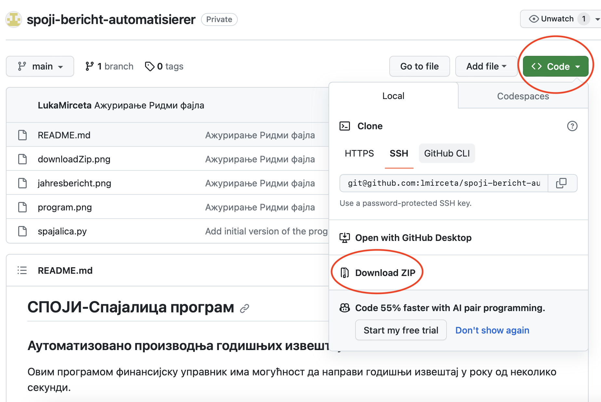
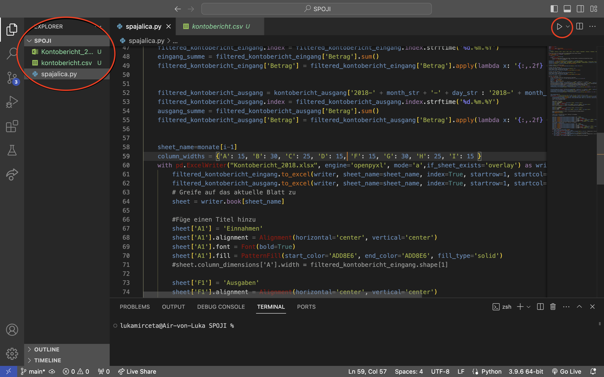

## Automatisierte Erstellung von Jahresberichten
**Mit diesem Programm kann der Finanzverwalter in wenigen Sekunden einen Jahresbericht erstellen.**

### Wie richtet man das Programm auf dem eigenen Computer ein?

Wenn du bereits die **spajalica.py** Datei besitzt, kannst du diesen Schritt überspringen.

#### Kopiere dieses GitHub Repository auf deinen Computer
Die einfachste Methode ist, das Repository als ZIP-Datei herunterzuladen. So kannst du es machen:

Wenn du bereits eine gültige Git-Installation auf deinem Computer hast, kannst du den folgenden Befehl verwenden:

``` cmd
git clone https://github.com/MircetaLuka/monatsbericht-automatisierung.git
```

Du kannst es auch per SSH herunterladen:

```cmd 
git clone git@github.com:MircetaLuka/monatsbericht-automatisierung.git
```


#### Extrahiere die ZIP-Datei in einen Ordner deiner Wahl
Wenn du die ZIP-Datei heruntergeladen hast, musst du sie in einem Ordner deiner Wahl entpacken. Die heruntergeladene Datei befindet sich im Ordner "Downloads" auf deinem Computer. Durch einen Doppelklick öffnet sich die ZIP-Datei, und du kannst die Dateien per Drag & Drop z.B. auf deinen Desktop ziehen.

#### Lade [Visual Studio Code](https://code.visualstudio.com) herunter
Nachdem du das Programm erfolgreich auf deinen Desktop oder in einen anderen Ordner verschoben hast, kannst du die Datei **spajalica.py** in einem Editor deiner Wahl öffnen, z.B. **[VS Code](https://code.visualstudio.com)**. Klicke auf den Link, um die neueste Version herunterzuladen.

#### Wie erstellt man einen Bericht mit diesem Programm?
Bevor du **spajalica.py** öffnest, musst du die neueste Version der Datei Kontobericht.csv herunterladen, die du von deinem George-Konto bekommst. Füge diese Datei in denselben Ordner ein, in dem sich auch das Programm befindet. Durch einen Doppelklick auf **spajalica.py** öffnet sich der Editor, den du im vorherigen Schritt installiert hast. Nun musst du nur noch auf den Play-Button klicken, und ein neuer .xlsx-Bericht wird erstellt. So sieht das aus:

Im linken Kreis siehst du deinen Ordner, der die **kontobericht.csv** (die Datei, die du von George heruntergeladen hast) und **Kontobericht_2018** (den vom Programm erstellten Bericht) enthält. Es ist wichtig zu erwähnen, dass die Datei, die du von George herunterlädst, **kontoberichte.csv** heißen muss. Wenn sie anders heißt, ändere bitte den Namen entsprechend, da das Programm die Daten sonst nicht finden kann.

Im rechten Kreis siehst du den Play-Button, der das Programm startet.

Programmierer: Luka Mirčeta

